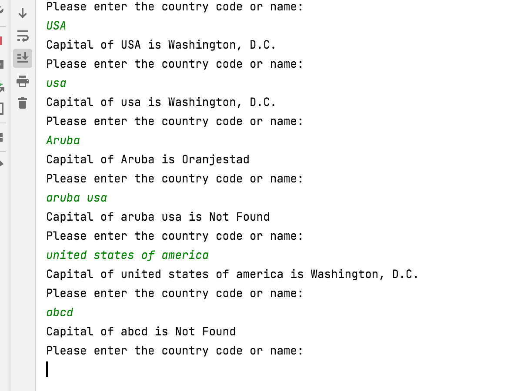

# rest-countries-api

### Testcases:
https://docs.google.com/spreadsheets/d/1vqQaKn03cMMB1jgc_k6Hjov-wDSitV9b9TTGUgkyFzw/edit?usp=sharing 

### OUTPUT

### Run Unit testcases
src/test/java/TestRestCountriesApi.java

### Description
Using the provided REST service, create a program that returns, at minimum, capital city based on user input for name or code. 
Write several tests that validate positive and negative scenario’s 

User input can be done in any format, including but not limited to prompts and console entries.   

Program must continue running until the user exits the program. 

Note: Do not use any other web services or data other then the one provide. 
https://restcountries.com/#api-endpoints-v3 

